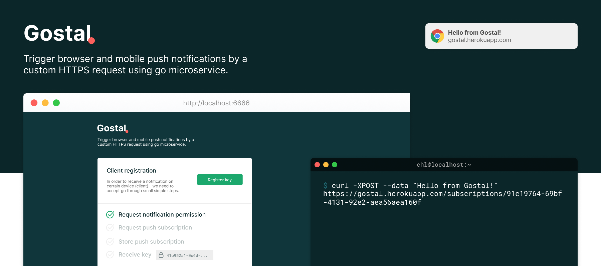

# Gostal - a minimal web push notifications service

Trigger [browser and mobile push notifications][web-push] by a custom HTTPS
request using this go microservice.



```sh
# Start a gostal service anywhere, it will create a database and VAPID
# credentials for you on start.
$ PORT=3061 gostal "gostal@lipautz.org"
> Using subscriber "gostal@lipautz.org"

$ gostal -help
> Usage of gostal:
>   -creds string
>        filename for credentials (default "credentials.json")
>   -db string
>        filename for database (default "subscribers.db")

# Send a sample message using curl
$ curl -XPOST --data "Ahoi" http://<gostal-service>/subscriptions/<key>
```

[VAPID keys][vapid] are generated on start...

```json
{
  privateKey: "...",
  publicKey: "..."
}
```

[web-push]: https://developers.google.com/web/fundamentals/push-notifications/ "Web Push Notifications: Timely, Relevant, and Precise"
[vapid]: https://blog.mozilla.org/services/2016/04/04/using-vapid-with-webpush/ "Using VAPID with WebPush"
